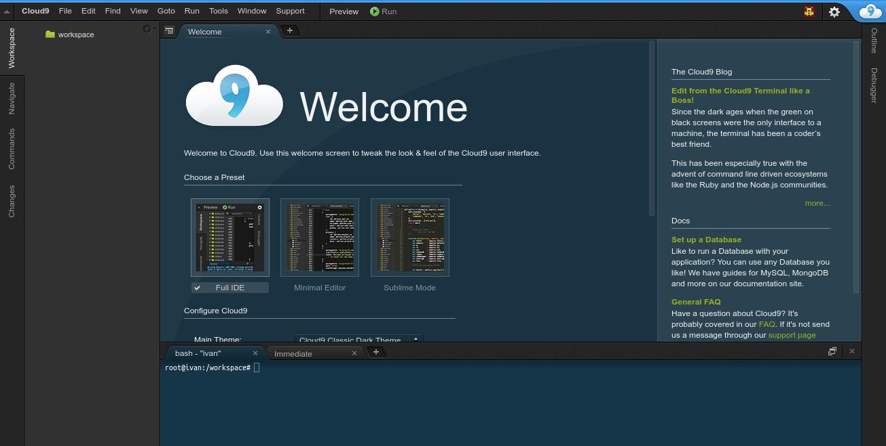

Cloud9 v3 Dockerfile
=============

This repository contains Dockerfile of Cloud9 IDE for Docker's automated build published to the public Docker Hub Registry.

# About Cloud9 IDE
[Cloud9 IDE](https://c9.io/)

# Base Docker Image
[kdelfour/supervisor-docker](https://registry.hub.docker.com/u/kdelfour/supervisor-docker/)

# Installation

## Install Docker.

Download automated build from public Docker Hub Registry: docker pull ivankristianto/cloud9-docker-apache2

(alternatively, you can build an image from Dockerfile: docker build -t="ivankristianto/cloud9-docker-apache2" github.com/ivankristianto/cloud9-docker-apache2)

## Usage

    docker run -it -d -p 80:80 --net=host ivankristianto/cloud9-docker-apache2
    
You can add a workspace as a volume directory with the argument *-v /your-path/workspace/:/workspace/* like this :

    docker run -it -d -p 80:80 --net=host -v /your-path/workspace/:/workspace/ ivankristianto/cloud9-docker-apache2
    
## Build and run with custom config directory

Get the latest version from github

    git clone https://github.com/ivankristianto/cloud9-docker-apache2
    cd cloud9-docker-apache2/

Build it

    sudo docker build --force-rm=true --tag="$USER/cloud9-docker-apache2:latest" .
    
And run

    sudo docker run -d -p 80:80 --net=host -v /your-path/workspace/:/workspace/ $USER/cloud9-docker-apache2:latest

## Workaround
If your server has ConfigServer Firewall

To resolve this create the following in `/etc/csf/csfpre.sh`

	iptables -t nat -N DOCKER
	iptables -t nat -A PREROUTING -m addrtype --dst-type LOCAL -j DOCKER
	iptables -t nat -A OUTPUT ! -d 127.0.0.0/8 -m addrtype --dst-type LOCAL -j DOCKER
	iptables -t nat -A POSTROUTING -s 172.17.0.0/16 ! -o docker0 -j MASQUERADE

	iptables -t filter -N DOCKER
	iptables -t filter -A FORWARD -o docker0 -j DOCKER
	iptables -t filter -A FORWARD -o docker0 -m conntrack --ctstate RELATED,ESTABLISHED -j ACCEPT
	iptables -t filter -A FORWARD -i docker0 ! -o docker0 -j ACCEPT
	iptables -t filter -A FORWARD -i docker0 -o docker0 -j ACCEPT

## Library

* Apache
* PHP5
* Gulp
* Composer

Enjoy !!    
